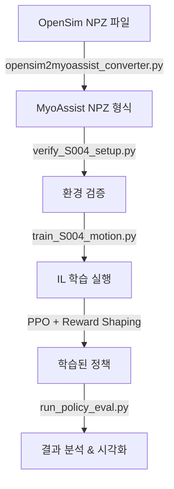

# 🎯 MyoAssist 모방학습 (Imitation Learning) 완벽 가이드

## 📊 요약

MyoAssist에서 OpenSim 모션 데이터를 사용한 모방학습 환경을 완벽하게 설정했습니다!

---

## 🔍 모방학습 방식 분석 결과

### ✅ **"Reference Motion Tracking with Reward Shaping"**

이 프레임워크는 **GAIL, AIRL이 아닌** 직접적인 tracking 기반 모방학습을 사용합니다.

**특징:**
- ✅ PPO + Imitation Reward Shaping
- ✅ Discriminator 없음 (GAIL/AIRL 아님)
- ✅ Expert trajectory를 직접 보상 함수에 반영
- ✅ 계산 효율적, 구현 단순
- ✅ DeepMimic (SIGGRAPH 2018) 스타일

**보상 계산:**
```python
q_reward = dt * exp(-8 * (qpos_diff)²)   # 관절 위치
dq_reward = dt * exp(-8 * (qvel_diff)²)  # 관절 속도
total_reward = imitation_reward + forward_reward + penalties
```

---

## 📁 생성된 파일들

### 1. 데이터 변환 도구
```
opensim2myoassist_converter.py      # OpenSim → MyoAssist 2D 형식 변환
opensim2myoassist_3D_converter.py   # OpenSim → MyoAssist 3D 형식 변환
inspect_data_structures.py          # 데이터 구조 검사 도구
```

### 2. 변환된 데이터
```
rl_train/reference_data/
  ├── S004_trial01_08mps.npz       # 2D reference motion (20개 신호)
  │   ├── metadata (샘플링 레이트, 길이 등)
  │   └── series_data
  │       ├── q_pelvis_tx, q_pelvis_ty, q_pelvis_tilt
  │       ├── q_hip_flexion_r/l
  │       ├── q_knee_angle_r/l
  │       ├── q_ankle_angle_r/l
  │       └── dq_* (속도 데이터)
  │
  └── S004_trial01_08mps_3D.npz    # 3D reference motion (32개 신호)
      ├── metadata (model_type: 3D, 16 DOF)
      └── series_data
          ├── q_pelvis_tx, q_pelvis_ty, q_pelvis_tz
          ├── q_pelvis_list, q_pelvis_tilt, q_pelvis_rotation
          ├── q_hip_flexion_r/l, q_hip_adduction_r/l, q_hip_rotation_r/l
          ├── q_knee_angle_r/l
          ├── q_ankle_angle_r/l
          └── qd* (속도 데이터)
```

### 3. 학습 설정
```
rl_train/train/train_configs/
  ├── S004_trial01_08mps_config.json      # 2D 모델용 설정
  │   ├── 모델: 22muscle_2D
  │   ├── 16개 병렬 환경
  │   └── 네트워크: [64, 64]
  │
  └── S004_trial01_08mps_3D_config.json   # 3D 모델용 설정
      ├── 모델: 26muscle_3D
      ├── 8개 병렬 환경 (더 무거움)
      └── 네트워크: [128, 128]
```

### 4. 편의 스크립트
```
train_S004_motion.py         # 2D 학습 실행 스크립트
train_S004_motion_3D.py      # 3D 학습 실행 스크립트
verify_S004_setup.py         # 환경 검증 스크립트
setup_environment.py         # 자동 환경 설정
run_S004_training.bat        # Windows 원클릭 실행
```

### 5. 문서
```
S004_IMITATION_LEARNING_GUIDE.md    # 완전한 가이드 문서
2D_vs_3D_COMPARISON.md              # 2D vs 3D 상세 비교
```

---

## 🚀 빠른 시작 (Quick Start)

### 🎯 2D vs 3D 선택하기

| 특성 | 2D 모델 | 3D 모델 |
|------|---------|---------|
| **운동 평면** | Sagittal만 | 전체 3D |
| **DOF** | 8 | 16 |
| **계산 속도** | 빠름 ⚡ | 느림 🔥 |
| **적합한 용도** | 평지 보행, 프로토타입 | 복잡한 동작, 완전한 시뮬레이션 |

👉 **초보자/빠른 개발: 2D로 시작!**  
👉 **완전한 연구/최종 결과: 3D 사용!**

자세한 비교는 [`2D_vs_3D_COMPARISON.md`](2D_vs_3D_COMPARISON.md) 참조

### Windows 사용자 (가장 쉬움)

```batch
# 원클릭 실행!
run_S004_training.bat
```

### Python 직접 실행

#### 2D 모델 (권장 - 시작용)
```bash
# 1단계: 환경 설정
python setup_environment.py

# 2단계: 검증
python verify_S004_setup.py

# 3단계: 빠른 테스트
python train_S004_motion.py --quick_test

# 4단계: 전체 학습
python train_S004_motion.py
```

#### 3D 모델 (고급 - 완전한 시뮬레이션)
```bash
# 빠른 테스트
python train_S004_motion_3D.py --quick_test

# 전체 학습 (GPU 권장)
python train_S004_motion_3D.py --device cuda
```

---

## 📊 전체 워크플로우



### 1️⃣ 데이터 변환
```bash
python opensim2myoassist_converter.py \
    "C:/workspace_home/opensim data/LD_gdp/S004/level_08mps/trial_01.npz" \
    "rl_train/reference_data/S004_trial01_08mps.npz"
```

**결과:**
- ✅ 12,028 프레임 (120.28초)
- ✅ 100 Hz → 30 Hz 리샘플링
- ✅ 20개 신호 (위치 + 속도)

### 2️⃣ 환경 검증
```bash
python verify_S004_setup.py
```

**확인 사항:**
- ✅ Reference data 로드
- ✅ 필수 키 존재
- ✅ 환경 생성 가능
- ✅ Reset/Step 작동

### 3️⃣ 학습 실행
```bash
# 옵션 1: 빠른 테스트 (5만 스텝)
python train_S004_motion.py --quick_test

# 옵션 2: 전체 학습 (3천만 스텝)
python train_S004_motion.py

# 옵션 3: 커스텀
python train_S004_motion.py --num_envs 8 --device cuda
```

### 4️⃣ 결과 평가
```bash
python rl_train/run_policy_eval.py rl_train/results/train_session_[timestamp]
```

**생성되는 결과:**
- 📊 보행 분석 그래프
- 🎬 시뮬레이션 영상
- 📈 관절 궤적 비교
- 💪 근육 활성화 패턴

---

## ⚙️ 설정 커스터마이징

### Config 파일 수정
`rl_train/train/train_configs/S004_trial01_08mps_config.json`

```json
{
    "total_timesteps": 3e7,
    "env_params": {
        "num_envs": 16,              // PC 사양에 맞게 조정
        "min_target_velocity": 0.8,   // Reference motion 속도
        "reward_keys_and_weights": {
            "qpos_imitation_rewards": {
                "knee_angle_l": 1.0,      // 무릎 중요!
                "pelvis_tilt": 1.0,       // 자세 유지
                "hip_flexion_l": 0.2      // 미세 조정
            }
        }
    },
    "ppo_params": {
        "learning_rate": 0.0001,
        "n_steps": 1024,              // num_envs * n_steps ≈ 16384
        "device": "cpu"               // "cuda" for GPU
    }
}
```

### 학습 옵션

| 옵션 | 설명 | 예시 |
|------|------|------|
| `--quick_test` | 빠른 테스트 (5만 스텝) | `python train_S004_motion.py --quick_test` |
| `--num_envs N` | 병렬 환경 개수 | `--num_envs 8` |
| `--device DEVICE` | CPU/GPU 선택 | `--device cuda` |
| `--render` | 렌더링 활성화 | `--render` |

---

## 🎓 기술 상세

### Reference Data 형식

**MyoAssist 요구사항:**
```python
{
    'metadata': {
        'sample_rate': int,      # Hz
        'data_length': int,      # frames
        'height_m': float,
        'weight_kg': float
    },
    'series_data': {
        # 위치 (q_*)
        'q_pelvis_tx': np.array,
        'q_pelvis_ty': np.array,
        'q_pelvis_tilt': np.array,
        'q_hip_flexion_r/l': np.array,
        'q_knee_angle_r/l': np.array,
        'q_ankle_angle_r/l': np.array,
        
        # 속도 (dq_*)
        'dq_pelvis_tx': np.array,
        'dq_pelvis_ty': np.array,
        'dq_pelvis_tilt': np.array,
        'dq_hip_flexion_r/l': np.array,
        'dq_knee_angle_r/l': np.array,
        'dq_ankle_angle_r/l': np.array,
    }
}
```

### 환경 구조

```python
Environment: myoAssistLegImitationExo-v0
  ├── 관측 공간: (44,)
  │   ├── 관절 위치 (8)
  │   ├── 관절 속도 (9)
  │   ├── 근육 활성화 (22)
  │   ├── 접촉력 (4)
  │   └── 목표 속도 (1)
  │
  └── 행동 공간: (24,)
      ├── 인간 근육 (22)
      └── 외골격 (2)
```

### 보상 함수 상세

```python
# 1. 관절 위치 모방 보상
for joint in ['pelvis_tilt', 'hip_flexion', 'knee_angle', 'ankle_angle']:
    diff = sim_qpos - ref_qpos
    reward_qpos += weight * dt * exp(-8 * diff²)

# 2. 관절 속도 모방 보상
for joint in joints:
    diff = sim_qvel - ref_qvel * speed_ratio
    reward_qvel += weight * dt * exp(-8 * diff²)

# 3. 전진 보상
reward_forward = velocity_x * dt

# 4. 페널티
penalty_muscle = -activation * dt
penalty_joint_limit = -constraint_force * dt

# 총 보상
total_reward = reward_qpos + reward_qvel + reward_forward - penalties
```

---

## 🔧 트러블슈팅

### 문제 1: 메모리 부족
```bash
# 해결: 환경 개수 줄이기
python train_S004_motion.py --num_envs 4
```

### 문제 2: gymnasium 모듈 없음
```bash
# 해결: 환경 설정 실행
python setup_environment.py
```

### 문제 3: 학습 불안정
```json
// Config 수정
{
    "ppo_params": {
        "learning_rate": 0.00005,  // 학습률 감소
        "clip_range": 0.1,         // 클리핑 강화
        "target_kl": 0.005         // KL 제한
    }
}
```

### 문제 4: 보상 개선 없음
- Reference motion 품질 확인
- 목표 속도 조정
- 보상 가중치 튜닝
- `verify_S004_setup.py`로 데이터 확인

---

## 📈 기대 결과

### 학습 진행 (예상)

| Timesteps | 평균 보상 | Episode 길이 | 상태 |
|-----------|----------|------------|------|
| 0 - 1M | -5 ~ 0 | 50 - 100 | 초기 학습 |
| 1M - 10M | 0 ~ 5 | 100 - 300 | 안정화 |
| 10M - 30M | 5 ~ 15 | 300 - 600 | 최적화 |

### 최종 결과물

- ✅ 학습된 정책 (.zip)
- ✅ 학습 로그 (JSON)
- ✅ 분석 그래프
- ✅ 시뮬레이션 영상
- ✅ 보행 메트릭

---

## 📚 추가 학습 자료

### MyoAssist 공식 문서
- 🌐 https://myoassist.neumove.org/
- 📖 [RL Guide](https://myoassist.neumove.org/reinforcement-learning/)
- 📓 [Imitation Tutorial](docs/tutorial/rl_imitation_tutorial.ipynb)

### 참고 논문
- **DeepMimic** (SIGGRAPH 2018) - 유사한 방식
- **Stable-Baselines3** - PPO 구현
- **MyoSuite** - 근골격 시뮬레이션

---

## ✅ 체크리스트

- [x] OpenSim 데이터를 MyoAssist 형식으로 변환
- [x] Reference data 검증 완료
- [x] 학습 설정 파일 생성
- [x] 편의 스크립트 작성
- [x] 완전한 문서화
- [ ] **이제 학습을 시작하세요!** 🚀

---

## 🎉 시작하기

```bash
# Windows에서
run_S004_training.bat

# 또는 Python으로
python train_S004_motion.py --quick_test
```

**Good luck with your imitation learning! 🎯**

---

## 📞 도움말

문제가 발생하면:
1. `verify_S004_setup.py` 실행
2. `S004_IMITATION_LEARNING_GUIDE.md` 참조
3. GitHub Issues: https://github.com/neumovelab/myoassist/issues

---

*마지막 업데이트: 2025-11-14*
